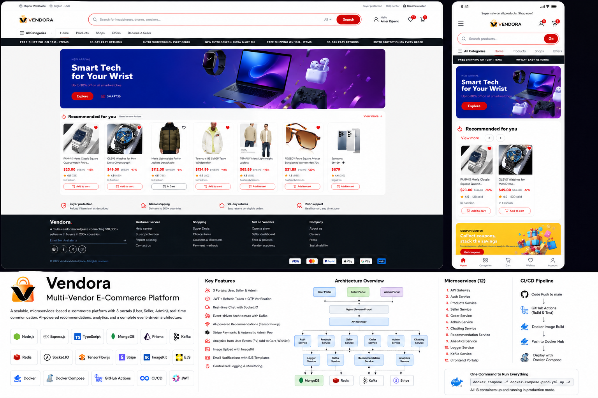
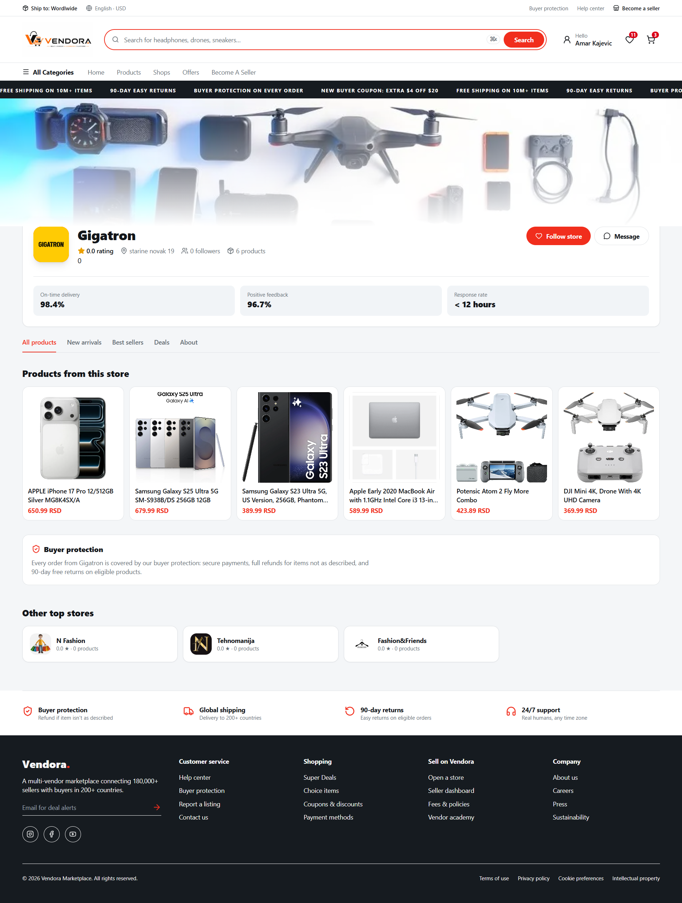
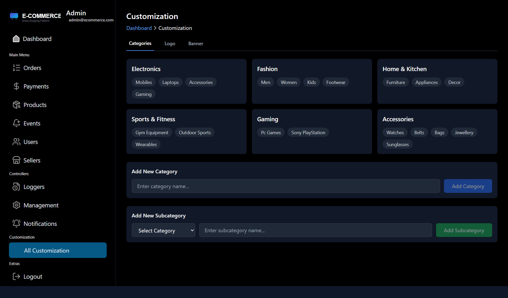

# Vendora — Multi-Vendor E-Commerce Marketplace

<p align="center">
  
</p>

<p align="center">
  <strong>A full-stack multi-vendor marketplace built with Next.js, Node.js, Kafka, Redis, Stripe, TensorFlow.js, Docker and GitHub Actions.</strong>
</p>

<p align="center">
  <a href="https://github.com/AmarKajevic/Vendora-Multi-vendor-ecommerce-platform">
    
  </a>
  
  
  
  
  
  
  
</p>

---

## Overview

**Vendora** is a full-stack multi-vendor e-commerce marketplace designed to model the core workflows of a real online marketplace rather than a simple CRUD shopping application.

The platform provides **three dedicated portals** for different roles:

* **User Portal** — shopping, cart, wishlist, checkout, orders, seller communication and recommendations
* **Seller Portal** — shop management, product creation, product media and seller workflows
* **Admin Portal** — user/seller management and platform customization

Behind the portals, the platform uses **10 backend applications/services**, an API Gateway, Kafka-based asynchronous processing, Redis-backed real-time state, Stripe payments, TensorFlow.js recommendations and containerized deployment through Docker and GitHub Actions.

The project is structured as an **Nx monorepo with domain-oriented backend services and independent frontend applications**.

---

## Why I Built Vendora

The goal was to build more than an e-commerce interface.

Vendora was designed to demonstrate practical experience with:

* service-oriented backend architecture
* API Gateway patterns
* authentication and authorization
* asynchronous event-driven systems
* real-time communication
* distributed application state
* marketplace payments
* behavioral analytics
* recommendation systems
* containerization
* CI/CD automation

The project intentionally combines **synchronous request/response workflows** with **asynchronous event processing** so that different workloads can evolve independently.

---

# Architecture

```text
                                  ┌──────────────────────┐
                                  │      User Portal      │
                                  │      Next.js 16       │
                                  └──────────┬───────────┘
                                             │
                                  ┌──────────▼───────────┐
                                  │     Seller Portal     │
                                  │      Next.js 16       │
                                  └──────────┬───────────┘
                                             │
                                  ┌──────────▼───────────┐
                                  │      Admin Portal      │
                                  │      Next.js 16        │
                                  └──────────┬────────────┘
                                             │
                                             ▼
                                  ┌───────────────────────┐
                                  │         NGINX           │
                                  │ Reverse Proxy / Entry   │
                                  └───────────┬────────────┘
                                              │
                                              ▼
                                  ┌───────────────────────┐
                                  │      API Gateway       │
                                  │      Node.js / HTTP    │
                                  └───────────┬────────────┘
                                              │
                  ┌───────────────────────────┼────────────────────────────┐
                  │            │              │              │             │
                  ▼            ▼              ▼              ▼             ▼
             ┌────────┐  ┌──────────┐  ┌──────────┐  ┌──────────┐  ┌──────────┐
             │  Auth  │  │ Products │  │  Seller  │  │  Orders  │  │  Admin   │
             │ Service│  │ Service  │  │ Service  │  │ Service  │  │ Service  │
             └────────┘  └──────────┘  └──────────┘  └──────────┘  └──────────┘
                  │            │              │              │
                  └────────────┴──────────────┴──────────────┘
                                               │
                                               ▼
                                      ┌────────────────┐
                                      │      Kafka      │
                                      │  Event Backbone │
                                      └───────┬────────┘
                                              │
                          ┌───────────────────┼────────────────────┐
                          │                   │                    │
                          ▼                   ▼                    ▼
                    ┌────────────┐     ┌────────────┐      ┌──────────────┐
                    │ Analytics  │     │   Logger   │      │ Chat Events  │
                    │   Events   │     │   Events   │      │              │
                    └─────┬──────┘     └─────┬──────┘      └──────┬───────┘
                          │                  │                    │
                          ▼                  ▼                    ▼
                  Recommendation       Logger Service        Chat Service
                    TensorFlow.js                              Redis + DB
```

### Detailed architecture

[](docs/ARCHITECTURE.png)

See the full architectural documentation in [`ARCHITECTURE.md`](ARCHITECTURE.md).

---

# Core Features

## Customer Experience

* account registration
* OTP verification
* JWT access-token authentication
* refresh-token authentication
* product discovery
* categories and subcategories
* product variants such as sizes
* cart management
* wishlist management
* checkout and orders
* seller communication
* personalized product recommendations

## Seller Portal

* shop creation and management
* product creation
* product descriptions and attributes
* categories and subcategories
* product variants
* image uploads through ImageKit
* seller-side marketplace workflows
* Stripe seller onboarding

## Admin Portal

* users management
* sellers management
* banners
* logos
* visual customization
* platform-level configuration

---

# Engineering Highlights

## 1. Domain-Oriented Backend Architecture

The backend is split into focused applications with explicit responsibilities:

| Service                  | Responsibility                                        |
| ------------------------ | ----------------------------------------------------- |
| `api-gateway`            | Central entry point and service routing               |
| `auth-service`           | Registration, login, OTP, JWT and refresh-token flows |
| `products-service`       | Product creation and catalog operations               |
| `seller-service`         | Seller and shop workflows                             |
| `order-service`          | Checkout, orders and Stripe payment logic             |
| `admin-service`          | Platform administration                               |
| `chatting-service`       | Real-time messaging and async persistence             |
| `recommendation-service` | Recommendation generation                             |
| `logger-service`         | Kafka-driven logging and live event streaming         |
| `kafka-service`          | Kafka-related event processing                        |

---

# 2. API Gateway

All three portals communicate through a centralized API Gateway.

```text
User / Seller / Admin
          │
          ▼
        NGINX
          │
          ▼
     API Gateway
          │
          ├── Auth Service
          ├── Products Service
          ├── Seller Service
          ├── Order Service
          └── Admin Service
```

The gateway centralizes:

* request routing
* service entry points
* cross-cutting middleware
* rate limiting
* CORS handling
* authentication-related gateway concerns

---

# 3. Authentication & Security

Vendora uses:

* JWT access tokens
* refresh tokens
* OTP verification
* protected authenticated routes
* role-specific application access
* rate limiting
* CORS protection

### Authentication flow

```text
User Registration
       │
       ▼
 Create Account
       │
       ▼
  Generate OTP
       │
       ▼
   EJS Email
       │
       ▼
 Verify OTP
       │
       ▼
Authenticated Session
       │
       ├── Access Token
       └── Refresh Token
```

---

# 4. Event-Driven Architecture with Kafka

Kafka is used for workloads that should not block the main user request.

Examples include:

* product views
* add-to-cart events
* wishlist events
* application logs
* chat messages

### Analytics flow

```text
User Action
    │
    ▼
Application Service
    │
    ▼
 Kafka Event
    │
    ▼
Analytics Consumer
    │
    ▼
Behavioral Data
    │
    ▼
Recommendation Service
    │
    ▼
Recommended Products
```

---

# 5. Real-Time Chat

The platform includes customer-to-seller real-time messaging.

```text
WebSocket
   │
   ├── Real-time message delivery
   │
   └── Kafka event
          │
          ▼
    Chat Consumer
          │
          ▼
      Batch DB Write
          │
          ▼
       Persistent Data
```

Redis is used for:

* online presence
* unseen message counters

The real-time path is separated from durable persistence so WebSocket delivery does not depend on a synchronous database write for every incoming message.

---

# 6. Recommendation System

Vendora includes a recommendation service built with **TensorFlow.js for Node.js**.

Behavioral signals include:

* product views
* cart actions
* wishlist interactions

```text
Product View
Add To Cart
Wishlist
     │
     ▼
   Kafka
     │
     ▼
Analytics Data
     │
     ▼
Recommendation Service
     │
     ▼
TensorFlow.js
     │
     ▼
Recommended Products
```

---

# 7. Marketplace Payments with Stripe

Stripe is used for:

* customer payments
* seller Stripe onboarding
* marketplace payment processing
* platform/admin fee calculation

```text
Customer
   │
   ▼
Checkout
   │
   ▼
Stripe Payment
   │
   ▼
Order Service
   │
   ├── Seller Amount
   └── Platform Fee
```

---

# 8. Logging & Event Monitoring

Application events are published to Kafka and consumed by the logger service.

```text
Application
    │
    ▼
  Kafka
    │
    ▼
Logger Consumer
    │
    ▼
In-Memory Queue
    │
    ▼
WebSocket Clients
```

---

# 9. Image & Email Infrastructure

### Image Management

Product and shop media are handled through **ImageKit**, keeping image storage and transformation concerns outside the application repository.

### Transactional Emails

The backend uses **EJS templates** for emails such as:

* OTP verification
* registration-related messages
* order notifications

---

# Technology Stack

## Frontend

* Next.js 16
* React 19
* TypeScript
* Zustand
* Next/Image

## Backend

* Node.js 24
* TypeScript
* Express
* REST APIs
* WebSockets / Socket.IO
* API Gateway

## Data & Messaging

* MongoDB
* Prisma
* Redis
* Apache Kafka
* Zookeeper

## Authentication & Security

* JWT
* Refresh Tokens
* OTP Verification
* CORS
* Rate Limiting

## Payments & Media

* Stripe
* ImageKit
* EJS

## Machine Learning

* TensorFlow.js

## Infrastructure & DevOps

* Nx
* pnpm
* Docker
* Docker Compose
* Nginx
* Docker Hub
* GitHub Actions

---

# Monorepo Structure

```text
Vendora/
│
├── apps/
│   ├── user-ui/
│   ├── seller-ui/
│   ├── admin-ui/
│   │
│   ├── api-gateway/
│   ├── auth-service/
│   ├── products-service/
│   ├── seller-service/
│   ├── order-service/
│   ├── admin-service/
│   ├── chatting-service/
│   ├── recommendation-service/
│   ├── logger-service/
│   └── kafka-service/
│
├── packages/
│   ├── error-handler/
│   ├── middleware/
│   ├── libs/
│   └── utils/
│
├── prisma/
├── docs/
├── .github/
│   └── workflows/
│       ├── ci.yml
│       └── docker-publish.yml
│
├── docker-compose.yml
├── docker-compose.prod.yml
├── nx.json
├── package.json
└── pnpm-workspace.yaml
```

---

# CI/CD

Vendora uses **GitHub Actions** to automate monorepo builds and Docker image publishing.

### Pipeline

```text
Git Push
    │
    ▼
GitHub Actions
    │
    ├── Install pnpm dependencies
    ├── Nx verification
    ├── Build applications
    ├── Verify backend artifacts
    ├── Package build outputs
    │
    ▼
Docker Build Matrix
    │
    ├── Backend images
    ├── Frontend images
    └── Layer caching
    │
    ▼
Docker Hub
    │
    ├── latest
    └── commit SHA
```

---

# Dockerized Deployment

The production stack is started through Docker Compose using published Docker Hub images.

```bash
docker compose -f docker-compose.prod.yml pull
docker compose -f docker-compose.prod.yml up -d
```

Check running containers:

```bash
docker compose -f docker-compose.prod.yml ps
```

The stack includes:

* Nginx
* API Gateway
* backend services
* User UI
* Seller UI
* Admin UI
* Kafka
* Zookeeper
* Redis

---

# Local Development

## Requirements

* Node.js 24+
* pnpm
* Docker
* Docker Compose

External integrations may also require:

* MongoDB
* Redis
* Kafka
* Stripe
* ImageKit
* SMTP configuration

## Installation

```bash
pnpm install
```

## Start development

```bash
pnpm dev
```

## Build

```bash
pnpm build
```

---

# Environment Variables

Create the required environment variables before running the application locally.

Example:

```env
DATABASE_URL=
REDIS_DATABASE_URL=

SMTP_USER=
SMTP_PASS=
SMTP_PORT=
SMTP_SERVICE=gmail
SMTP_HOST=smtp.gmail.com

ACCESS_TOKEN_SECRET=
REFRESH_TOKEN_SECRET=

STRIPE_SECRET_KEY=
STRIPE_WEBHOOK_SECRET=

IMAGEKIT_SECRET_KEY=
IMAGEKIT_PUBLIC_KEY=

KAFKA_API_KEY=
KAFKA_API_SECRET=

DOCKER_USERNAME=
```

### Environment variable reference

| Variable                | Purpose                            |
| ----------------------- | ---------------------------------- |
| `DATABASE_URL`          | Database connection string         |
| `REDIS_DATABASE_URL`    | Redis connection string            |
| `SMTP_USER`             | SMTP account username              |
| `SMTP_PASS`             | SMTP account password/app password |
| `SMTP_PORT`             | SMTP server port                   |
| `SMTP_SERVICE`          | SMTP provider                      |
| `SMTP_HOST`             | SMTP server hostname               |
| `ACCESS_TOKEN_SECRET`   | JWT access-token signing secret    |
| `REFRESH_TOKEN_SECRET`  | Refresh-token signing secret       |
| `STRIPE_SECRET_KEY`     | Stripe server-side API key         |
| `STRIPE_WEBHOOK_SECRET` | Stripe webhook signing secret      |
| `IMAGEKIT_SECRET_KEY`   | ImageKit server-side secret        |
| `IMAGEKIT_PUBLIC_KEY`   | ImageKit public key                |
| `KAFKA_API_KEY`         | Kafka authentication key           |
| `KAFKA_API_SECRET`      | Kafka authentication secret        |
| `DOCKER_USERNAME`       | Docker Hub username                |


---

# Screenshots

## Customer Portal

<p align="center">
  
  
</p>

<p align="center">
  
  
</p>

<p align="center">
  
  
</p>

## Seller Portal

<p align="center">
  
  
</p>

## Admin Portal

<p align="center">
  
  
</p>

---

# Key Engineering Decisions

### Why an API Gateway?

To provide a single entry point for all three frontend applications and isolate internal service addresses from the clients.

### Why Kafka?

To move non-blocking workloads such as analytics, logging and chat persistence out of latency-sensitive request paths.

### Why Redis?

For fast, short-lived state such as online presence and unseen message counters.

### Why asynchronous chat persistence?

To keep WebSocket delivery responsive while Kafka buffers messages before batch persistence.

### Why Nx?

To maintain a single versioned codebase for frontend applications, backend services and shared packages while benefiting from project graph management, build orchestration and caching.

More detailed architectural decisions are documented in [`ARCHITECTURE.md`](ARCHITECTURE.md).

---

# What This Project Demonstrates

Vendora demonstrates the ability to work across the full application lifecycle:

```text
Frontend Applications
        │
        ▼
      Nginx
        │
        ▼
   API Gateway
        │
        ▼
 Domain Services
        │
        ├──────────────► MongoDB / Prisma
        │
        ├──────────────► Redis
        │
        └──────────────► Kafka
                              │
                              ▼
                      Async Consumers
                              │
                 ┌────────────┼─────────────┐
                 ▼            ▼             ▼
          Recommendations   Logging    Chat Persistence
                 │            │             │
                 └────────────┴─────────────┘
                              │
                              ▼
                            Docker
                              │
                              ▼
                        GitHub Actions
                              │
                              ▼
                          Docker Hub
                              │
                              ▼
                      Docker Compose
```

The project goes beyond a standard CRUD e-commerce implementation by combining:

**marketplace workflows + distributed backend services + event-driven processing + real-time communication + recommendations + payments + containerized deployment.**

---

# Documentation

* [Architecture Documentation](ARCHITECTURE.md)
* [Architecture Diagram](docs/ARCHITECTURE.png)
* [GitHub Repository](https://github.com/AmarKajevic/Vendora-Multi-vendor-ecommerce-platform)

---

# Author

**Amar Kajevic**

Full-Stack Developer focused on:

**Node.js · React · Next.js · TypeScript · Backend Architecture**

[GitHub](https://github.com/AmarKajevic)

---

> Vendora was built as a portfolio project to demonstrate practical full-stack engineering, backend architecture, asynchronous systems, real-time communication and deployment automation.
