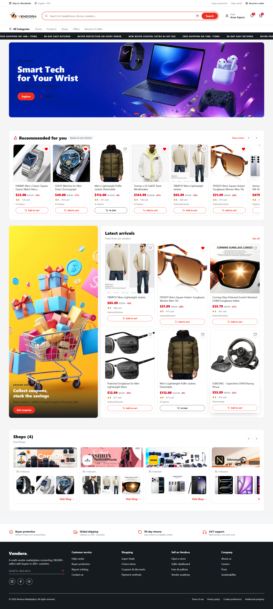
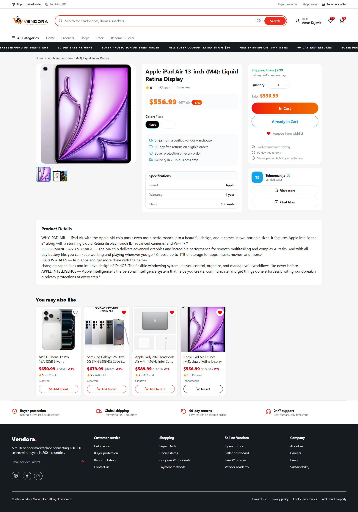
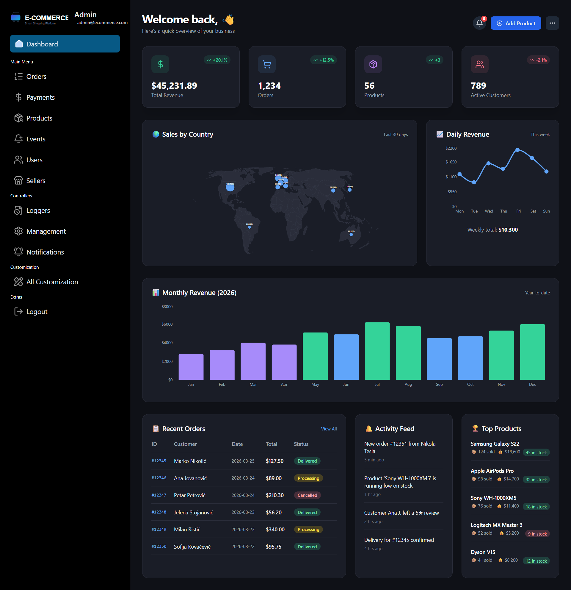

# Vendora — Multi-Vendor E-Commerce Platform


> A production-oriented multi-vendor e-commerce platform built as an Nx monorepo with three portals, domain-oriented backend services, event-driven communication with Kafka, real-time messaging, recommendations powered by TensorFlow.js, Stripe payments, Redis, Docker, GitHub Actions and Docker Hub.

---

## Overview

**Vendora** is a full-stack multi-vendor e-commerce platform designed around a marketplace model where customers, sellers and administrators have separate applications and workflows.

The system is organized as an **Nx monorepo** containing three frontend portals and a set of backend/domain services exposed through an **API Gateway**. The platform combines traditional request/response APIs with asynchronous event processing for analytics, chat persistence and logging.

The goal of the project was not only to build an e-commerce UI, but to implement a realistic backend architecture containing authentication, marketplace workflows, payments, messaging, analytics, recommendations, centralized routing, caching, observability and containerized deployment.

---

## Why Vendora?

Vendora models the core workflows of a real marketplace:

- customers browse products, manage carts and wishlists, place orders and communicate with sellers;
- sellers create and manage their shops and products;
- administrators manage users, sellers and platform customization;
- marketplace revenue is generated through an automatically calculated **admin/platform fee** on completed sales;
- user behavior is collected as analytics events and used by a recommendation service;
- real-time conversations allow customers to ask sellers product-related questions.

There are **no hard-coded product/catalog records in the application flow**. The platform is designed around persisted application data and service-to-service communication.

---

## Architecture

```text
                                      ┌──────────────────────┐
                                      │      User Portal      │
                                      │      Next.js 16       │
                                      └──────────┬───────────┘
                                                 │
                                      ┌──────────▼───────────┐
                                      │     Seller Portal     │
                                      │      Next.js 16       │
                                      └──────────┬───────────┘
                                                 │
                                      ┌──────────▼───────────┐
                                      │      Admin Portal      │
                                      │      Next.js 16        │
                                      └──────────┬────────────┘
                                                 │
                                                 ▼
                                      ┌───────────────────────┐
                                      │        NGINX           │
                                      │ Reverse Proxy / Entry │
                                      └───────────┬───────────┘
                                                  │
                                                  ▼
                                      ┌───────────────────────┐
                                      │      API Gateway        │
                                      │      Node.js / HTTP    │
                                      └───────────┬────────────┘
                                                  │
                    ┌─────────────────────────────┼─────────────────────────────┐
                    │             │               │              │              │
                    ▼             ▼               ▼              ▼              ▼
              ┌──────────┐ ┌────────────┐ ┌────────────┐ ┌────────────┐ ┌────────────┐
              │   Auth   │ │  Products  │ │   Seller   │ │   Orders   │ │   Admin    │
              │ Service  │ │  Service   │ │  Service   │ │  Service   │ │  Service   │
              └──────────┘ └────────────┘ └────────────┘ └────────────┘ └────────────┘
                    │             │              │             │
                    │             │              │             │
                    └─────────────┴──────────────┴─────────────┘
                                            │
                                            ▼
                                   ┌────────────────┐
                                   │      Kafka      │
                                   │ Event Backbone  │
                                   └───────┬────────┘
                                           │
                         ┌─────────────────┼──────────────────┐
                         │                 │                  │
                         ▼                 ▼                  ▼
                  ┌────────────┐   ┌────────────┐    ┌───────────────┐
                  │ Analytics  │   │   Logger   │    │ Chat Message  │
                  │   Events   │   │   Events   │    │    Events     │
                  └─────┬──────┘   └─────┬──────┘    └───────┬───────┘
                        │                │                   │
                        ▼                ▼                   ▼
                 ┌─────────────┐  ┌─────────────┐   ┌──────────────┐
                 │Recommendation│  │Logger Service│   │Chat Service  │
                 │  TensorFlow  │  │   WebSocket  │   │ WebSocket +  │
                 │              │  │   Clients    │   │ Redis + DB   │
                 └─────────────┘  └─────────────┘   └──────────────┘
```

### Service boundaries

| Component | Responsibility |
|---|---|
| `user-ui` | Customer-facing storefront and user workflows |
| `seller-ui` | Seller dashboard, product/shop management and seller workflows |
| `admin-ui` | User, seller, banner, logo and platform customization management |
| `api-gateway` | Central entry point, routing and cross-cutting gateway concerns |
| `auth-service` | Registration, login, OTP verification, JWT access/refresh authentication |
| `products-service` | Product creation, catalog retrieval and product-related operations |
| `seller-service` | Seller/shop profile management and marketplace seller workflows |
| `order-service` | Checkout, order creation and Stripe payment integration |
| `admin-service` | Administrative operations and platform management |
| `chatting-service` | Real-time customer/seller messaging, Kafka-backed persistence and unread state |
| `recommendation-service` | Recommendation generation from behavioral analytics using TensorFlow.js |
| `logger-service` | Consumes log events and streams them to connected monitoring clients |
| `kafka-service` | Kafka-related application functionality and event processing |

---

## Technology Stack

### Frontend

- **Next.js 16**
- **React 19**
- **TypeScript**
- **Zustand** for client-side state management
- Next/Image and image optimization

### Backend

- **Node.js 24**
- **TypeScript**
- API Gateway architecture
- REST APIs
- WebSockets
- **Socket.IO / WebSocket-based real-time communication**

### Authentication & Security

- JWT access tokens
- Refresh tokens
- OTP-based verification
- Protected authenticated workflows
- API gateway and middleware-based request handling
- Rate limiting and CORS handling where applicable

### Data & Infrastructure

- **MongoDB** / Prisma-based application data access
- **Redis** for ephemeral state and counters
- **Apache Kafka** for asynchronous events
- **Zookeeper** for the Kafka deployment used by the project

### Payments & Media

- **Stripe** for checkout and payment processing
- Stripe-connected seller profiles/accounts
- Automatic marketplace/admin fee calculation
- **ImageKit** for product and shop images
- **EJS** templates for transactional emails

### Machine Learning

- **TensorFlow.js for Node.js**
- Behavioral analytics pipeline for recommendation generation

### DevOps

- **Nx monorepo**
- **pnpm workspaces**
- Docker
- Docker Compose
- Docker Hub
- GitHub Actions
- Nginx

---

## Core Features

### Customer Portal

The customer-facing application provides the main shopping experience:

- registration and account creation;
- OTP verification;
- login/logout and refresh-token authentication;
- product browsing and product details;
- categories and subcategories;
- product variants such as sizes;
- cart management;
- wishlist management;
- checkout and payment;
- order workflows;
- seller communication through real-time chat;
- personalized/recommended products based on behavioral events.

### Seller Portal

Sellers have a dedicated management portal where they can:

- create and manage a seller/shop profile;
- create products with descriptions and attributes;
- configure sizes, categories and subcategories;
- upload product images through ImageKit;
- manage seller-side marketplace operations;
- create/connect a Stripe seller profile for payments.

### Admin Portal

Administrators have centralized platform management capabilities for:

- users;
- sellers;
- banners;
- logos;
- visual/customization settings;
- platform-level administration.

---

## Authentication Flow

Vendora uses a token-based authentication model with **JWT access tokens, refresh tokens and OTP verification**.

High-level flow:

```text
User Registration
       │
       ▼
Create Account
       │
       ▼
OTP Generated
       │
       ▼
EJS Email Template
       │
       ▼
User Verifies OTP
       │
       ▼
Authenticated Session
       │
       ├── Access Token
       └── Refresh Token
```

The same architecture is used to protect authenticated customer, seller and administrator workflows while keeping authentication logic centralized inside the auth service.

---

## Event-Driven Architecture with Kafka

Kafka is used where asynchronous processing is a better fit than coupling the user request directly to every downstream operation.

Examples of application events include:

- product views;
- add-to-cart actions;
- wishlist actions;
- application logs;
- chat messages.

A simplified analytics flow looks like this:

```text
User Action
    │
    ▼
Application Service
    │
    ▼
Kafka Event
    │
    ▼
Analytics Consumer
    │
    ▼
Stored Behavioral Data
    │
    ▼
Recommendation Service
    │
    ▼
Recommended Products
```

This decouples event producers from consumers and allows analytics, recommendation and logging workloads to evolve independently from the synchronous request path.

---

## Recommendation System

Vendora includes a recommendation service built around **TensorFlow.js for Node.js**.

The recommendation pipeline is based on behavioral signals captured from user activity such as product views, cart actions and wishlist interactions.

Conceptually:

```text
Product View
Add To Cart
Wishlist
     │
     ▼
   Kafka
     │
     ▼
 Analytics Data
     │
     ▼
 Recommendation Service
     │
     ▼
 TensorFlow.js Model
     │
     ▼
 Recommended Products
```

The important architectural idea is that recommendation generation is separated from the main product/order request path instead of embedding model logic directly into the storefront or product service.

---

## Real-Time Chat Architecture

Vendora provides customer-to-seller messaging for product questions and communication.

The chat service is designed around three concerns:

1. **Real-time delivery** through WebSocket connections.
2. **Asynchronous persistence** through Kafka.
3. **Ephemeral online/unread state** through Redis and in-memory connection tracking.

Simplified flow:

```text
Customer
   │
   │ WebSocket
   ▼
Chat Service
   │
   ├──────────────► Seller WebSocket
   │
   └──────────────► Kafka: chat.new_message
                         │
                         ▼
                   Chat Consumer
                         │
                         ▼
                       Prisma
                         │
                         ▼
                       Database

Redis
  ├── online state
  └── unseen message counters
```

Messages are first delivered in real time. The chat service then publishes a `chat.new_message` event to Kafka. A dedicated consumer buffers incoming messages and periodically performs a batch `createMany` database write. Unread state is updated only after the database write succeeds.

This separates the latency-sensitive real-time path from durable message persistence and reduces unnecessary one-row-at-a-time database writes under message bursts.

---

## Logging & Live Monitoring

The logger service consumes log events from Kafka and processes them in batches before broadcasting them to connected monitoring clients.

```text
Application Event
      │
      ▼
    Kafka
      │
      ▼
 Logger Consumer
      │
      ▼
 In-Memory Queue
      │
  batch interval
      │
      ▼
WebSocket Clients
```

This gives the system an asynchronous logging pipeline and makes it possible to observe runtime events without forcing every service to synchronously communicate with a central logging endpoint.

---

## Marketplace Payments & Platform Revenue

Vendora uses **Stripe** for payment processing.

Sellers can create/connect a Stripe profile as part of the seller onboarding workflow. For each order, the platform automatically calculates the configured **admin/platform fee** so that Vendora itself can operate as a marketplace business model rather than simply acting as a storefront.

High-level flow:

```text
Customer
   │
   ▼
Checkout
   │
   ▼
Stripe Payment
   │
   ▼
Order Service
   │
   ├── Seller amount
   └── Platform/Admin fee
```

---

## Image Management

Product and shop images are handled through **ImageKit** rather than being stored directly inside the application repository.

This keeps image assets outside the application codebase and allows image delivery and transformations to be handled by a dedicated media platform.

---

## Transactional Emails

The platform uses **EJS templates** for transactional emails such as:

- OTP verification;
- registration-related messages;
- order-related notifications.

Email generation is separated from the frontend so that transactional communication remains part of the backend workflow.

---

## State Management

The frontend uses **Zustand** for client-side state management.

Server-backed data remains persisted in the backend/database layer; Zustand is used for application state on the client rather than treating the browser store as the source of truth.

---

## Monorepo Structure

A simplified project structure:

```text
Vendora/
│
├── apps/
│   ├── user-ui/
│   ├── seller-ui/
│   ├── admin-ui/
│   │
│   ├── api-gateway/
│   ├── auth-service/
│   ├── products-service/
│   ├── seller-service/
│   ├── order-service/
│   ├── admin-service/
│   ├── chatting-service/
│   ├── recommendation-service/
│   ├── logger-service/
│   └── kafka-service/
│
├── packages/
│   ├── error-handler/
│   ├── middleware/
│   ├── libs/
│   └── utils/
│
├── prisma/
├── docs/
├── .github/
│   └── workflows/
│       ├── ci.yml
│       └── docker-publish.yml
│
├── docker-compose.yml
├── docker-compose.prod.yml
├── nx.json
├── package.json
└── pnpm-workspace.yaml
```

---

## CI/CD Pipeline

The project uses **GitHub Actions** to automatically build the monorepo and publish production Docker images to Docker Hub whenever changes are pushed to `main`.

```text
Git Push
   │
   ▼
GitHub Actions
   │
   ├── Install pnpm dependencies
   ├── Nx build
   ├── Verify backend dist outputs
   ├── Package backend build artifacts
   │
   ▼
Docker Build Matrix
   │
   ├── Build backend images
   ├── Build frontend images
   ├── Docker layer cache
   │
   ▼
Docker Hub
   │
   ├── latest
   └── <short commit SHA>
```

The repository publishes the following application images:

```text
amar997/vendora-api-gateway
amar997/vendora-auth-service
amar997/vendora-products-service
amar997/vendora-seller-service
amar997/vendora-order-service
amar997/vendora-admin-service
amar997/vendora-chatting-service
amar997/vendora-recommendation-service
amar997/vendora-logger-service
amar997/vendora-kafka-service
amar997/vendora-user-ui
amar997/vendora-seller-ui
amar997/vendora-admin-ui
```

---

## Dockerized Production Stack

The production compose configuration runs the platform from published Docker Hub images.

Infrastructure includes:

- Nginx
- API Gateway
- authentication and domain services
- three frontend applications
- Kafka
- Zookeeper
- Redis/integration services used by the application

Start the production stack with:

```bash
docker compose -f docker-compose.prod.yml pull
docker compose -f docker-compose.prod.yml up -d
```

Check container health/status:

```bash
docker compose -f docker-compose.prod.yml ps
```

The application is exposed through Nginx on:

```text
http://localhost
```

---

## Local Development

Install dependencies:

```bash
pnpm install
```

Run the workspace development targets:

```bash
pnpm dev
```

Build the applications:

```bash
pnpm build
```

The repository is managed as a pnpm workspace and Nx monorepo, allowing applications and shared packages to live in one codebase while maintaining independent service boundaries.

> Some integrations require environment variables and external services such as MongoDB, Redis, Kafka, Stripe, ImageKit and email configuration. Use your own local environment configuration for those dependencies.

---

## Environment Configuration

The project relies on environment variables for infrastructure and third-party integrations.

Typical configuration categories include:

```text
Database
JWT / refresh-token secrets
OTP / email settings
Redis
Kafka
Stripe
ImageKit
Frontend/API URLs
```

**Never commit real secrets, API keys or production credentials to GitHub.** Use GitHub Secrets for CI/CD credentials and local `.env` files for local development.

---

## Screenshots

Screenshots are intentionally included as a visual overview of the three portals and major workflows.

> Create a `docs/screenshots/` directory and place your exported screenshots there. Then update the filenames below to match the actual files.

### Customer Portal
<p align="center">
  
  
</p>


### Seller Portal


### Admin Portal



### Real-Time Chat


### Recommendations


---

## Project Documentation

Additional architecture documentation can be placed under `docs/`:

```text
docs/
├── ARCHITECTURE.md
├── ARCHITECTURE.png
└── screenshots/
    ├── user-home.png
    ├── product-details.png
    ├── cart-checkout.png
    ├── seller-dashboard.png
    ├── product-create.png
    ├── admin-dashboard.png
    ├── chat.png
    └── recommendations.png
```

---

## Engineering Highlights

Vendora was built to demonstrate practical backend and full-stack engineering rather than only UI implementation.

The project demonstrates:

- monorepo architecture with Nx and pnpm;
- domain-oriented Node.js services;
- centralized API Gateway routing;
- JWT + refresh-token authentication;
- OTP verification;
- role-specific user, seller and admin applications;
- Kafka-based event-driven processing;
- behavioral analytics;
- TensorFlow.js recommendation logic;
- real-time WebSocket communication;
- Redis-backed online/unread state;
- asynchronous/batched chat persistence;
- Kafka-driven logging;
- Stripe payment processing;
- marketplace/admin fee calculation;
- ImageKit media management;
- EJS transactional email templates;
- Dockerized services and frontend applications;
- Docker Compose production stack;
- GitHub Actions CI/CD;
- Docker Hub image publishing;
- cache-aware monorepo builds.

---

## Architectural Decisions

### Why an API Gateway?

The gateway gives the three frontend applications a centralized entry point and keeps service addresses and routing concerns out of the client applications.

### Why Kafka?

Kafka is used for workloads that do not need to block the original HTTP/WebSocket request, such as analytics, logging and durable chat persistence.

### Why Redis?

Redis is appropriate for short-lived application state such as online presence and unseen message counters, where extremely fast reads/writes are more important than relational durability.

### Why separate the chat write path?

The real-time path should stay responsive even when database persistence experiences temporary load. Publishing messages to Kafka and batching database inserts provides a buffer between message delivery and persistence.

### Why an Nx monorepo?

The monorepo keeps shared packages, frontend applications and backend services in one versioned codebase while Nx provides project graph awareness, build orchestration and caching.

---

## Current Docker / Production Verification

The production compose stack has been verified locally using published Docker Hub images.

The verified stack includes:

- 3 frontend containers;
- 10 application/backend service containers;
- Nginx;
- Kafka;
- Zookeeper.

This confirms that the same images published by the CI pipeline can be pulled and started through the production compose configuration.

---

## What This Project Demonstrates

Vendora is intended as a portfolio project demonstrating the ability to work across the full application lifecycle:

```text
Frontend
   ↓
API Gateway
   ↓
Domain Services
   ↓
Database / Redis
   ↓
Kafka Events
   ↓
Async Consumers
   ↓
Recommendations / Logging / Persistence
   ↓
Docker
   ↓
GitHub Actions
   ↓
Docker Hub
   ↓
Production Compose
```

The project is deliberately broader than a standard CRUD e-commerce application and focuses on service boundaries, asynchronous processing, real-time communication and deployment automation.

---

## Author

**Amar Kajevic**

Full-Stack Developer focused on **Node.js, React, Next.js and scalable backend architecture**.

GitHub: [AmarKajevic](https://github.com/AmarKajevic)

---

## License

This project is intended as a portfolio/demo application. Add the license you want to use for the repository if you plan to permit reuse or distribution.
